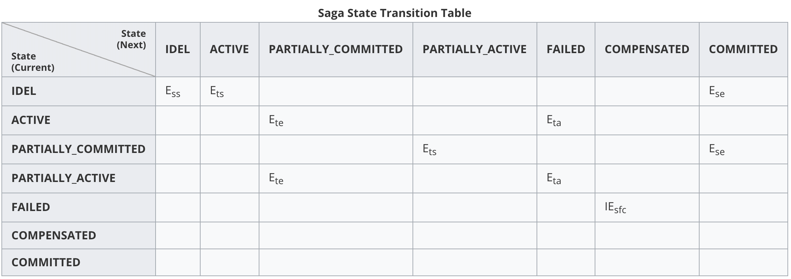
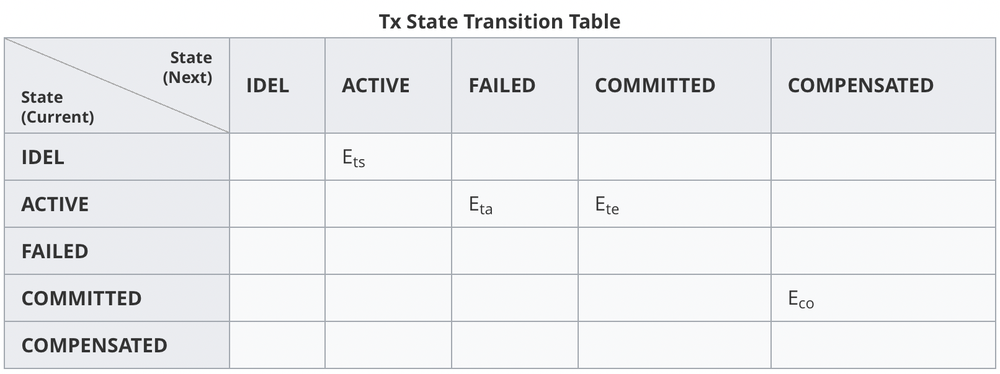

# Saga

* Event Definition

  - Ess SagaStartedEvent
  - Ese SagaEndedEvent
  - Ets TxStartedEvent
  - Ete TxEndedEvent
  - Eta TxAbortedEvent
  - Eco TxCompensateEvent
  - IEsfc Internal Event Successful full compensation

* Saga State Machine

  

  

* Tx State Machine
  

  

* Reference

  * [servicecomb](https://cwiki.apache.org/confluence/display/SERVICECOMB/Using+StateMachine+for+tracing+the+transaction+states)
  * [state transition table](https://en.wikipedia.org/wiki/State_transition_table)
  * [uml](http://plantuml.com/en/)

