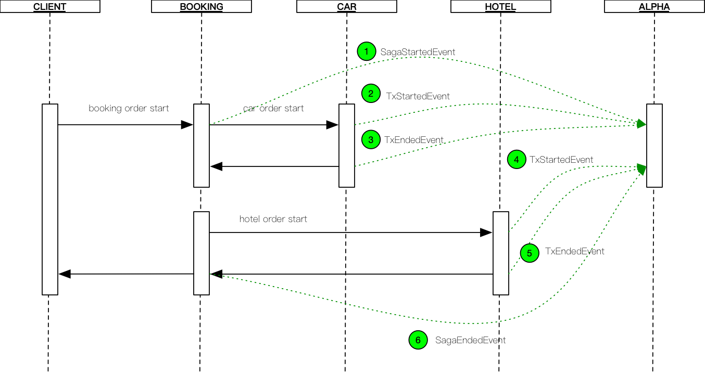

# Saga

### Event Definition

- Ess SagaStartedEvent 
- Ese SagaEndedEvent
- EsaSagaAbortedEvent  (Tx抛出非超时异常时发送)
- EsoSagaTimeoutEvent (Tx抛出超时异常时发送)
- Ets TxStartedEvent
- Ete TxEndedEvent
- Eta TxAbortedEvent (Tx内部方法抛出非超时异常时)
- Eto TxTimeoutEvent (Tx内部方法抛出超时异常时)
- Eco TxCompensateEvent
- IEsfc Internal Event Successful full compensation

### Saga Sequence Diagram

正常时序图

| id | current state       | event              | next state          |
|----| ------------------- | ------------------ | ------------------- |
|1| START               | SagaStartedEvent-1 | IDEL                |
|2| IDEL                | TxStartedEvent-11  | PARTIALLY_ACTIVE    |
|3| PARTIALLY_ACTIVE    | TxEndedEvent-11    | PARTIALLY_COMMITTED |
|4| PARTIALLY_COMMITTED | TxStartedEvent-12  | PARTIALLY_ACTIVE    |
|5| PARTIALLY_ACTIVE    | TxEndedEvent-12    | PARTIALLY_COMMITTED |
|6| PARTIALLY_COMMITTED | SagaEndedEvent-1   | END                 |

异常时序图

| id | current state       | event              | next state          |
|----| ------------------- | ------------------ | ------------------- |
|1| START               | SagaStartedEvent-1 | IDEL                |
|2| IDEL                | TxStartedEvent-11  | PARTIALLY_ACTIVE    |
|3| PARTIALLY_ACTIVE    | TxEndedEvent-11    | PARTIALLY_COMMITTED |
|4| PARTIALLY_COMMITTED | TxStartedEvent-12  | PARTIALLY_ACTIVE    |
|5| PARTIALLY_ACTIVE    | TxEndedEvent-12    | PARTIALLY_COMMITTED |
|6| PARTIALLY_COMMITTED | SagaEndedEvent-1   | END                 |

* 正常状态事件

  SagaStartedEvent-1
  TxStartedEvent-1
  TxEndedEvent-1
  TxStartedEvent-2
  TxEndedEvent-2
  SagaEndedEvent-1

  

* 异常状态事件：Tx2异常

  SagaStartedEvent-1
  TxStartedEvent-1
  TxEndedEvent-1
  TxStartedEvent-2
  TxAbortedEvent-2
  SagaAbortedEvent-1

  

* 异常状态事件：Tx2超时

  SagaStartedEvent-1
  TxStartedEvent-1
  TxEndedEvent-1
  TxStartedEvent-2
  TxAbortedEvent-2
  SagaAbortedEvent-1

* Tx State Machine
  

  

* Reference

  * [servicecomb](https://cwiki.apache.org/confluence/display/SERVICECOMB/Using+StateMachine+for+tracing+the+transaction+states)
  * [state transition table](https://en.wikipedia.org/wiki/State_transition_table)
  * [uml](http://plantuml.com/en/)

