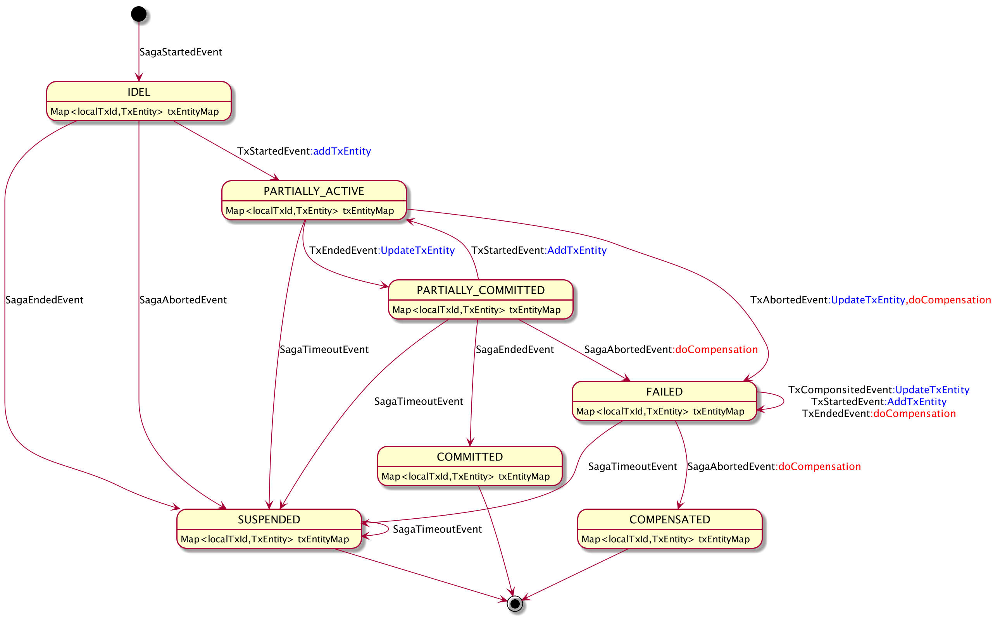

# Saga

* Event Definition

  - Ess SagaStartedEvent
  - Ese SagaEndedEvent
  - Ets TxStartedEvent
  - Ete TxEndedEvent
  - Eta TxAbortedEvent
  - Eco TxCompensateEvent
  - IEsfc Internal Event Successful full compensation

* Saga State Machine

  

  

* Tx State Machine
  

  

