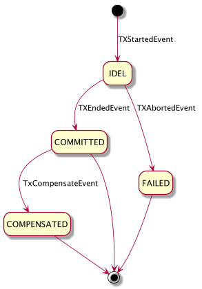
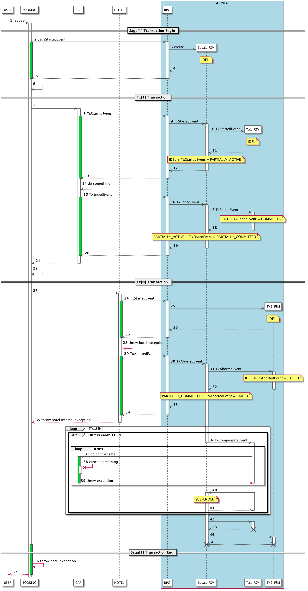

# Saga 状态机设计

### 事件定义

- Ess SagaStartedEvent 
- Ese SagaEndedEvent
- Esa SagaAbortedEvent
- Eso SagaTimeoutEvent
- Ets TxStartedEvent
- Ete TxEndedEvent
- Eta TxAbortedEvent
- Etm TxComponsitedEvent

### 状态机设计

状态机由Saga 状态机（全局事务）、Tx 状态机（子事务）组成

#### Saga 状态机

| State (Current/Next) | IDEL           | PARTIALLY_ACTIVE | PARTIALLY_COMMITTED | FAILED         | COMPENSATED    | COMMITTED      | SUSPENDED                       |
| ---------------------------------------- | ---------------------------------- | ------------------------------------ | --------------------------------------- | ---------------------------------- | ---------------------------------- | ---------------------------------- | --------------------------------------------------- |
| IDEL                 | Ess | Ets   |                                         |                                    |                                    |                                    | Ese / Esa |
| PARTIALLY_ACTIVE     |                                    |                                      | Ete      | Eta |                                    |                                    | Eso                  |
| PARTIALLY_COMMITTED  |                                    | Ets   |                                         | Esa |                                    | Ese |                                                     |
| FAILED               |                                    |                                      |                                         | Etm | Etm |                                    |                                                     |
| COMPENSATED          |                                    |                                      |                                         |                                    |                                    |                                    |                                                     |
| COMMITTED            |                                    |                                      |                                         |                                    |                                    |                                    |                                                     |
| SUSPENDED            |                                    |                                      |                                         |                                    |                                    |                                    |                                                     |

**注意：** FALIED + Etm = COMPENSATED 只有在所有状态是 Committed 的 Tx 都补偿完毕后会触发 

#### Tx 状态机

| State (Current/Next) | IDEL           | ACTIVE         | FAILED         | COMMITTED      | COMPENSATED    |
| ---------------------------------------- | ---------------------------------- | ---------------------------------- | ---------------------------------- | ---------------------------------- | ---------------------------------- |
| IDEL                 | Ess | Ets |                                    |                                    |                                    |
| ACTIVE               |                                    |                                    | Ete |                                    | Eta |
| FAILED               |                                    |                                    |                                    | Ets |                                    |
| COMMITTED            |                                    |                                    | Ete |                                    | Eta |
| COMPENSATED          |                                    |                                    |                                    |                                    |                                    |

### 时序图

* 正常时序图

按照以上场景，共发送6个事件，下表描述了正常情况下状态和事件的组合转换过程

| id | current state       | event              | next state          |
|----| ------------------- | ------------------ | ------------------- |
|1| START               | SagaStartedEvent-1 | IDEL               |
|2| IDEL                | TxStartedEvent-11  | PARTIALLY_ACTIVE    |
|3| PARTIALLY_ACTIVE    | TxEndedEvent-11    | PARTIALLY_COMMITTED |
|4| PARTIALLY_COMMITTED | TxStartedEvent-12  | PARTIALLY_ACTIVE    |
|5| PARTIALLY_ACTIVE    | TxEndedEvent-12    | PARTIALLY_COMMITTED |
|6| PARTIALLY_COMMITTED | SagaEndedEvent-1   | END                 |

* 异常时序图(酒店服务内部异常)

按照以上场景，共发送6个事件，下表描述了正常情况下状态和事件的组合转换过程，这里需要注意的是如果BOOKING捕获的是HOTEL的内部异常，那么不需要再发送SagaAbortedEvent事件，补偿的发起由Saga状态机状态转换到FAILED时触发[34]，Saga状态机会发送 TxCompensateEvent 事件给状态是 COMMITED 的Tx状态机[38]，补偿执行完毕后CAR服务会发送 TxCompensitedEvent 给 Saga 状态机[42]，Saga 状态机判断如果还有处于 COMMITED 的Tx时则保持自身状态 FAILED 不变[43]，否则修改自身状态为 COMPENSATED[44]

**注意：**此时BOOKING收到异常和ALPHA进行的事物补偿是异步进行的，此时BOOKING要考虑自身情况决定下一步的动作（强烈不建议自动重试）

**注意：**因为TxCompensateEvent是Saga发给Tx的内部事件，所以在状态图和状态表中没有体现

| id | current state       | event              | next state          |
|----| ------------------- | ------------------ | ------------------- |
|1| START             | SagaStartedEvent-1 | IDEL                |
|2| IDEL                | TxStartedEvent-11  | PARTIALLY_ACTIVE    |
|3| PARTIALLY_ACTIVE    | TxEndedEvent-11    | PARTIALLY_COMMITTED |
|4| PARTIALLY_COMMITTED | TxStartedEvent-12  | PARTIALLY_ACTIVE    |
|5| PARTIALLY_ACTIVE    | TxAbortedEvent-12  | FAILED |
|6| FAILED | TxComponsitedEvent-11   | COMPENSATED                 |

* 异常时序图(酒店服务超时异常-中断线程成功)

此场景和酒店服务内部异常处理流程类似，因为线程中断后会抛出 TransactionTimeoutException ，然后HOTEL发送 TxAbortedEvent 事件

**注意：** Omega设置的超时时间必须小于 request 的超时时间和 connect 的超时时间[23]

**注意：** Omega超时后有可能会出现线程无法中断的情况，这个时候不会发送 TxAbortedEvent 事件[31]，此时最终可能会导致BOOKING收到超时异常，这种情况会在 `异常时序图(酒店服务超时异常时中断线程失败)` 讨论

* 异常时序图(酒店服务超时异常-中断线程失败)

以上场景是HOTEL服务调用异常的特殊情况（在酒店服务调用可能成功或者失败前请求超时异常 `java.net.SocketTimeoutException`，或者网络异常 `java.net.ConnectException`），在BOOKING收到异常时HOTEL服务的Saga事物状态不确定，为了避免问题进一步扩大，此处将Saga事物状态设置为 `SUSPENDED` ，等待人工介入处理

**注意：** 为了尽可能避免以上问题的发生可以设置Omega超时时间，并且小于 request 的超时时间和 connect 的超时时间，这样在大部分情况下HOTEL处理线程都可以被终止，并且发送 `TxAbortedEvent` 事件，这样处理过程就变成了 `异常时序图(酒店服务超时异常-中断线程成功)`

| id | current state                            | event                                    | next state                              |
| ---------------------- | ------------------------------------------------------------ | ------------------------------------------------------------ | ----------------------------------------------------------- |
| 1  | START                                    | SagaStartedEvent-1                       | IDEL                                    |
| 2  | IDEL                                     | TxStartedEvent-11                        | PARTIALLY_ACTIVE                        |
| 3  | PARTIALLY_ACTIVE                         | TxEndedEvent-11                          | PARTIALLY_COMMITTED                     |
| 4  | PARTIALLY_COMMITTED                      | TxStartedEvent-12                        | PARTIALLY_ACTIVE                        |
| 5  | PARTIALLY_ACTIVE                         | TxEndedEvent-12 or TxAbortedEvent-12 | PARTIALLY_COMMITTED or FAILED |
| 6  | PARTIALLY_ACTIVE or PARTIALLY_COMMITTED or FAILED | SagaTimeoutEvent-1                       | SUSPEDNED                               |

* 异常时序图(酒店服务失败后补偿异常)

以上场景是调用HOTEL补偿方法时失败（在进程N此重试失败后），将Saga事物状态设置为 `SUSPENDED`，等待人工介入处理（这与原来的进行事务补偿失败后自动重试，直到成功的方式不同）

**注意：** 补偿失败后将永远不在进行补偿，进入挂起状态，等待人工介入

**注意：** 是否考虑允许用户定义补偿失败的策略，例如补偿几次，每次补偿间隔时间等

**注意：** 补偿失败后Saga状态的设置由TxFSM发起，此时在以下事件列表并没有体现（这可能不利于挂起原因的跟踪，是否考虑内部事件也进行记录）

| id | current state       | event              | next state          |
|----| ------------------- | ------------------ | ------------------- |
|1| START             | SagaStartedEvent-1 | IDEL                |
|2| IDEL                | TxStartedEvent-11  | PARTIALLY_ACTIVE    |
|3| PARTIALLY_ACTIVE    | TxEndedEvent-11    | PARTIALLY_COMMITTED |
|4| PARTIALLY_COMMITTED | TxStartedEvent-12  | PARTIALLY_ACTIVE    |
|5| PARTIALLY_ACTIVE    | TxAbortedEvent-12  | FAILED |
|6| FAILED | TxFSM call SagaFSM | SUSPENDED        |

* 异常时序图（订单服务异常）

以上场景是CAR，HOTEL都调用成功后BOOKING服务异常，进程补偿

**注意：** 以上时序图简化了 `TxComponsitedEvent` 事件发送过程，此处需要讨论此事件是否需要发送，还是根据补偿方法执行成功就认为补偿成功

| id | current state       | event              | next state          |
|----| ------------------- | ------------------ | ------------------- |
|1| START             | SagaStartedEvent-1 | IDEL                |
|2| IDEL                | TxStartedEvent-11  | PARTIALLY_ACTIVE    |
|3| PARTIALLY_ACTIVE    | TxEndedEvent-11    | PARTIALLY_COMMITTED |
|4| PARTIALLY_COMMITTED | TxStartedEvent-12  | PARTIALLY_ACTIVE    |
|5| PARTIALLY_ACTIVE    | TxEndedEvent-12 | PARTIALLY_COMMITTED |
|6| PARTIALLY_COMMITTED | SagaAbortedEvent-1 | COMPENSATED                 |

* 异常时序图(Omega发送SagaEndedEvent通信异常)

  未开始

* 异常时序图(Omega发送TxStartedEvent通信异常)

  未开始

### 其他建议

* 挂起的事物需要有一种机制可以及时通知用户，挂起的事物是是否协助用户自动调用用户定义稽核方法，做最后一次校验？或者MQ通知用户？
* 挂起的事物需要有详细的调用过程清单或者拓扑已便于用户手动分析
* 频繁失败的某类事物Alpha是否要拒绝冷却一段时间？
* 关于请求超时，网络超时，Omega超时，Saga超时需要有一个推荐配置，例如必须设置Omega超时，Omega超时必须在所有超时中最小等等。或者根据Omega的超时设置，动态修改请求的超时时间=Omega超时时间+N秒

### Reference

* [servicecomb](https://cwiki.apache.org/confluence/display/SERVICECOMB/Using+StateMachine+for+tracing+the+transaction+states)

