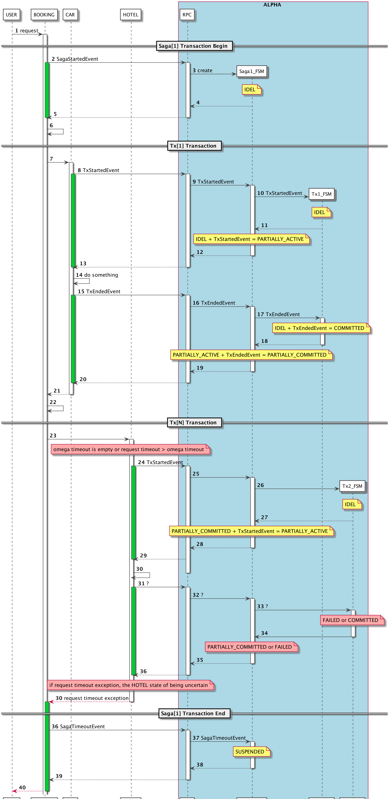

# Saga 状态机（Saga State Machine）

### 事件定义(Event Definition)

- Ess SagaStartedEvent 
- Ese SagaEndedEvent
- Esa SagaAbortedEvent
- Eso SagaTimeoutEvent
- Ets TxStartedEvent
- Ete TxEndedEvent
- Eta TxAbortedEvent
- Etm TxComponsitedEvent

### 状态机设计（State Machine Design）

状态机由Saga 状态机（全局事务）、Tx 状态机（子事务）组成

The state machine consists of a Saga state machine (global transaction) and a Tx state machine (sub-transaction)

#### Saga 状态机（Saga State Machine）

| State (Current/Next) | IDEL           | PARTIALLY_ACTIVE | PARTIALLY_COMMITTED | FAILED         | COMPENSATED    | COMMITTED      | SUSPENDED                       |
| ---------------------------------------- | ---------------------------------- | ------------------------------------ | --------------------------------------- | ---------------------------------- | ---------------------------------- | ---------------------------------- | --------------------------------------------------- |
| IDEL                 | Ess | Ets   |                                         |                                    |                                    |                                    | Ese / Esa |
| PARTIALLY_ACTIVE     |                                    |                                      | Ete      | Eta |                                    |                                    | Eso                  |
| PARTIALLY_COMMITTED  |                                    | Ets   |                                         | Esa |                                    | Ese |                                                     |
| FAILED               |                                    |                                      |                                         | Etm | Etm |                                    |                                                     |
| COMPENSATED          |                                    |                                      |                                         |                                    |                                    |                                    |                                                     |
| COMMITTED            |                                    |                                      |                                         |                                    |                                    |                                    |                                                     |
| SUSPENDED            |                                    |                                      |                                         |                                    |                                    |                                    |                                                     |

**注意：** FALIED + Etm = COMPENSATED 只有在所有状态是 Committed 的 Tx 都补偿完毕后会触发

**NOTE：** FALIED + Etm = COMPENSATED Triggered only after all Tx whose state is Committed is compensated

#### Tx 状态机（Tx State Machine）

| State (Current/Next) | IDEL           | ACTIVE         | FAILED         | COMMITTED      | COMPENSATED    |
| ---------------------------------------- | ---------------------------------- | ---------------------------------- | ---------------------------------- | ---------------------------------- | ---------------------------------- |
| IDEL                 | Ess | Ets |                                    |                                    |                                    |
| ACTIVE               |                                    |                                    | Ete |                                    | Eta |
| FAILED               |                                    |                                    |                                    | Ets |                                    |
| COMMITTED            |                                    |                                    | Ete |                                    | Eta |
| COMPENSATED          |                                    |                                    |                                    |                                    |                                    |

### 时序图（Sequence Diagram）

* 正常时序图（saga-sequence-successful-scenario）

以上场景，共发送6个事件，下表描述事件发送顺序和状态变化

In the above scenario, a total of 6 events are sent. The following table describes the event sending sequence and status changes.

| id | current state       | event              | next state          |
|----| ------------------- | ------------------ | ------------------- |
|1| START               | SagaStartedEvent-1 | IDEL               |
|2| IDEL                | TxStartedEvent-11  | PARTIALLY_ACTIVE    |
|3| PARTIALLY_ACTIVE    | TxEndedEvent-11    | PARTIALLY_COMMITTED |
|4| PARTIALLY_COMMITTED | TxStartedEvent-12  | PARTIALLY_ACTIVE    |
|5| PARTIALLY_ACTIVE    | TxEndedEvent-12    | PARTIALLY_COMMITTED |
|6| PARTIALLY_COMMITTED | SagaEndedEvent-1   | END                 |

* 异常时序图(酒店服务内部异常) saga-sequence-hotel-inner-exception-scenario

以上场景，共发送6个事件，下表描述了事件发送顺序和状态变化，这里需要注意的是如果BOOKING捕获的是HOTEL的内部异常，那么不需要再发送SagaAbortedEvent事件。补偿的发起由Saga状态机状态转换到FAILED时触发[34]，Saga状态机会发送 TxCompensateEvent 事件给状态是 COMMITTED 的Tx状态机[38]，补偿执行完毕后CAR服务会发送 TxCompensitedEvent 给 Saga 状态机[42]，Saga 状态机判断所有Tx状态机的状态，如果还存在 COMMITTED 状态的 Tx 时则保持自身状态 FAILED 不变[43]，否则修改自身状态为 COMPENSATED[44]

In the above scenario, a total of 6 events are sent. The following table describes the event sending sequence and status changes. It should be noted here that if BOOKING catches the internal exception of the HOTEL, then there is no need to send the SagaAbortedEvent event. The compensation trigger is triggered by the Saga state machine state to FAILED [34], and the Saga state machine sends the TxCompensateEvent event to the Tx state machine whose current state is COMMITTED [38]. After the compensation is completed, the CAR service will send TxCompensitedEvent to the Saga state machine [42]. The Saga state machine will judge the state of all Tx state machines. If there is still a  COMMITTED state of the Tx, the Tx keep FAILED state [43] otherwise, modify Saga  status to COMPENSATED[44]

**注意：** BOOKING收到异常和ALPHA进行的事物补偿是异步进行的，此时BOOKING要考虑自身情况决定下一步的动作（强烈不建议自动重试）

**NOTE：** BOOKING receives exceptions and ALPHA's transaction compensation is asynchronous, BOOKING should consider its own situation to determine the next action (strongly not recommended automatic retry)

**注意：** 因为TxCompensateEvent是Saga发给Tx的内部事件，所以在状态图和状态表中没有体现

**NOTE：** Because TxCompensateEvent is an internal event sent by Saga to Tx, it is not reflected in the state diagram and state table.

| id | current state       | event              | next state          |
|----| ------------------- | ------------------ | ------------------- |
|1| START             | SagaStartedEvent-1 | IDEL                |
|2| IDEL                | TxStartedEvent-11  | PARTIALLY_ACTIVE    |
|3| PARTIALLY_ACTIVE    | TxEndedEvent-11    | PARTIALLY_COMMITTED |
|4| PARTIALLY_COMMITTED | TxStartedEvent-12  | PARTIALLY_ACTIVE    |
|5| PARTIALLY_ACTIVE    | TxAbortedEvent-12  | FAILED |
|6| FAILED | TxComponsitedEvent-11   | COMPENSATED                 |

* 异常时序图(酒店服务超时异常-中断线程成功) saga-sequence-hotel-timeout-interrupted-exception-scenario

以上场景和酒店服务内部异常处理流程类似，因为线程中断后会抛出 TransactionTimeoutException ，然后HOTEL发送 TxAbortedEvent 事件

The above scenario is similar to the `saga-sequence-hotel-inner-exception-scenario` , because a TransactionTimeoutException is thrown after the thread is interrupted, and then the HOTEL sends a TxAbortedEvent event.

**注意：** Omega设置的超时时间必须小于 request 的超时时间和 connect 的超时时间[23]

**NOTE：** Omega's timeout must be less than the request's timeout and connect's timeout [23]

**注意：** Omega超时后有可能会出现线程无法中断的情况，这个时候不会发送 TxAbortedEvent 事件[31]，此时最终可能会导致BOOKING收到超时异常，这种情况会在 `异常时序图(酒店服务超时异常时中断线程失败)` 讨论

**NOTE：** After the Omega timeout, there may be a situation where the thread cannot be interrupted. The TxAbortedEvent event [31] will not be sent. At this time, the BOOKING may receive a timeout exception. This situation will be in the `saga-sequence-hotel-timeout-non-interrupt-exception-scenario` Discussion

* 异常时序图(酒店服务超时异常-中断线程失败) saga-sequence-hotel-timeout-non-interrupt-exception-scenario

以上场景是HOTEL服务调用异常的特殊情况（在酒店服务调用可能成功或者失败前请求超时异常 `java.net.SocketTimeoutException`，或者网络异常 `java.net.ConnectException`），在BOOKING收到异常时HOTEL服务的Saga事物状态不确定，为了避免问题进一步扩大，此处将Saga事物状态设置为 `SUSPENDED` ，等待人工介入处理

The above scenario is a special case of the HOTEL service  exception (request timeout exception `java.net.SocketTimeoutException`  or a network exception `java.net.ConnectException`) , HOTEL service call may succeed or fail, In order to avoid further expansion of the error, the Saga transaction status is set to `SUSPENDED` here, waiting for manual intervention.

**注意：** 为了尽可能避免以上问题的发生可以设置Omega超时时间，并且小于 request 的超时时间和 connect 的超时时间，这样在大部分情况下HOTEL处理线程都可以被终止，并且发送 `TxAbortedEvent` 事件，这样处理过程就变成了 `异常时序图(酒店服务超时异常-中断线程成功)`

**NOTE：** In order to avoid the above problems as much as possible, the Omega timeout less than the request timeout and the connect timeout. In most cases the HOTEL processing thread can be terminated and the `TxAbortedEvent` event is sent, the process is the same as the  `saga-sequence-hotel-timeout-interrupted-exception-scenario`

| id | current state                            | event                                    | next state                              |
| ---------------------- | ------------------------------------------------------------ | ------------------------------------------------------------ | ----------------------------------------------------------- |
| 1  | START                                    | SagaStartedEvent-1                       | IDEL                                    |
| 2  | IDEL                                     | TxStartedEvent-11                        | PARTIALLY_ACTIVE                        |
| 3  | PARTIALLY_ACTIVE                         | TxEndedEvent-11                          | PARTIALLY_COMMITTED                     |
| 4  | PARTIALLY_COMMITTED                      | TxStartedEvent-12                        | PARTIALLY_ACTIVE                        |
| 5  | PARTIALLY_ACTIVE                         | TxEndedEvent-12 or TxAbortedEvent-12 | PARTIALLY_COMMITTED or FAILED |
| 6  | PARTIALLY_ACTIVE or PARTIALLY_COMMITTED or FAILED | SagaTimeoutEvent-1                       | SUSPEDNED                               |

* 异常时序图(酒店服务失败后补偿异常) saga-sequence-hotel-inner-exception-compensate-exception-scenario

以上场景是调用HOTEL补偿方法时失败（在进程N次重试失败后），将Saga事物状态设置为 `SUSPENDED`，等待人工介入处理（这与原来的进行事务补偿失败后自动重试，直到成功的方式不同）

The above scenario is a failure when the HOTEL compensation method is called (retry after failure N), the Saga transaction status is set to `SUSPENDED`, waiting for manual intervention

**注意：** 补偿失败后将永远不在进行补偿，进入挂起状态，等待人工介入

**NOTE：** After the compensation fails, it will never be compensated, enter the suspended state, and wait for manual intervention.

**注意：** 建议允许用户定义补偿失败的策略，例如补偿几次，每次补偿间隔时间等

**NOTE：** It is recommended to allow the user to define the strategy of compensation failure, such as the number of compensation, compensation interval, etc.

**注意：** 补偿失败后Saga状态的设置由TxFSM发起，此时在以下事件列表并没有体现（这可能不利于挂起原因的跟踪，是否考虑内部事件也进行记录）

**NOTE：** After the compensation fails, the Saga state change is triggered by Tx, which is not reflected in the following event list (this may be detrimental to the tracking of the cause of the suspension, whether internal events are also considered for recording)

| id | current state       | event              | next state          |
|----| ------------------- | ------------------ | ------------------- |
|1| START             | SagaStartedEvent-1 | IDEL                |
|2| IDEL                | TxStartedEvent-11  | PARTIALLY_ACTIVE    |
|3| PARTIALLY_ACTIVE    | TxEndedEvent-11    | PARTIALLY_COMMITTED |
|4| PARTIALLY_COMMITTED | TxStartedEvent-12  | PARTIALLY_ACTIVE    |
|5| PARTIALLY_ACTIVE    | TxAbortedEvent-12  | FAILED |
|6| FAILED | TxFSM call SagaFSM | SUSPENDED        |

* 异常时序图（订单服务异常）saga-sequence-booking-exception-scenario

以上场景是CAR，HOTEL都调用成功后，BOOKING服务异常是的事件补偿

The above scenario describes the event compensation of the BOOKING service exception after the CAR and the HOTEL are successfully called.

**注意：** 以上时序图简化了 `TxComponsitedEvent` 事件发送过程，此处需要讨论此事件是否需要发送，还是根据补偿方法执行成功就认为补偿成功

**NOTE：** The above sequence diagram simplifies the `TxComponsitedEvent` event sending process (here we need to discuss whether this event needs to be sent or if the compensation method is successful, the compensation is considered successful.).

| id | current state       | event              | next state          |
|----| ------------------- | ------------------ | ------------------- |
|1| START             | SagaStartedEvent-1 | IDEL                |
|2| IDEL                | TxStartedEvent-11  | PARTIALLY_ACTIVE    |
|3| PARTIALLY_ACTIVE    | TxEndedEvent-11    | PARTIALLY_COMMITTED |
|4| PARTIALLY_COMMITTED | TxStartedEvent-12  | PARTIALLY_ACTIVE    |
|5| PARTIALLY_ACTIVE    | TxEndedEvent-12 | PARTIALLY_COMMITTED |
|6| PARTIALLY_COMMITTED | SagaAbortedEvent-1 | COMPENSATED                 |

* 异常时序图(Omega发送SagaEndedEvent通信异常) saga-sequence-omega-exception-sagaendedevent-scenario

以上场景是最后发送 `SagaEndedEvent` 失败的情况，如果Saga配置了timeout，那么在超时后Saga状态自动变成 `SUSPENDED` 

The above scenario is the case where the last send `SagaEndedEvent` fails. If Saga configures timeout, the Saga state automatically becomes `SUSPENDED` after the timeout.

**注意：** Saga超时如何设置？经验值？（是否可以根据实际执行时长移动平均后取3Sigma）

**NOTE：** How to set Saga timeout, Experience value? (Or 3 Sigma be taken after moving the average according to the actual execution time?)

**注意：** 如果Saga没有设置超时，那么Saga状态将一直处于 `PARTIALLY_COMMITTED` 状态，除非收到 `SagaEndedEvent` 后事务结束，这样就需要 SagaEndedEvent 需要重发机制（待讨论）

**NOTE：** If Saga does not set a timeout, the Saga state will remain `PARTIALLY_COMMITTED` , unless the transaction ends after receiving `SagaEndedEvent`, which requires a resend mechanism for SagaEndedEvent (to be discussed)

* 异常时序图(Omega发送TxStartedEvent通信异常) saga-sequence-omega-exception-txstartedevent-scenario

以上场景是Omega RPC 请求失败后抛出 `OmegaException`  给 BOOKING，BOOKING发送 `SagaAbortedEvent`  事件实现事务的补偿，事件与状态组合如下

The above scenario is that after the Omega RPC request fails, `OmegaException` is thrown to BOOKING, and BOOKING sends the `SagaAbortedEvent` event to implement the transaction compensation. The event and state are combined as follows

| id | current state       | event              | next state          |
|----| ------------------- | ------------------ | ------------------- |
|1| START             | SagaStartedEvent-1 | IDEL                |
|2| IDEL                | TxStartedEvent-11  | PARTIALLY_ACTIVE    |
|3| PARTIALLY_ACTIVE    | TxEndedEvent-11    | PARTIALLY_COMMITTED |
|4| PARTIALLY_COMMITTED | SagaAbortedEvent-1 | FAILED |
|5| FAILED | Tx call Saga FSM | COMPENSATED |

### 其他

* 挂起的事物及时通知用户（MQ或者其他方式）

  Suspend transaction to notify users in time (MQ or other ways)

* 挂起的事物需要有详细的调用过程清单或者拓扑已便于用户手动分析

  The suspended transaction need to have a detailed list of calling procedures or topologies that are easy for users to manually analyze

* 一段时间内经常失败的事物，Alpha熔断相同的请求？

  A transaction that often fails over time, Alpha fuses the same request？

* 关于请求超时，网络超时，Omega超时，Saga超时需要有一个推荐配置，例如必须设置Omega超时，Omega超时必须在所有超时中最小。或者根据Omega的超时设置，动态修改请求的超时时间=Omega超时时间+N秒

  For request timeouts, network timeouts, Omega timeouts, Saga timeouts, a recommended configuration is required, such as Omega timeouts must be set, Omega timeouts must be minimum in all timeouts. Or according to Omega timeout dynamic modification other timeouts，requests = Omega timeout + N seconds

* 状态机的持久化和恢复

  Design of State Machine Persistence

### Reference

* [servicecomb](https://cwiki.apache.org/confluence/display/SERVICECOMB/Using+StateMachine+for+tracing+the+transaction+states)

